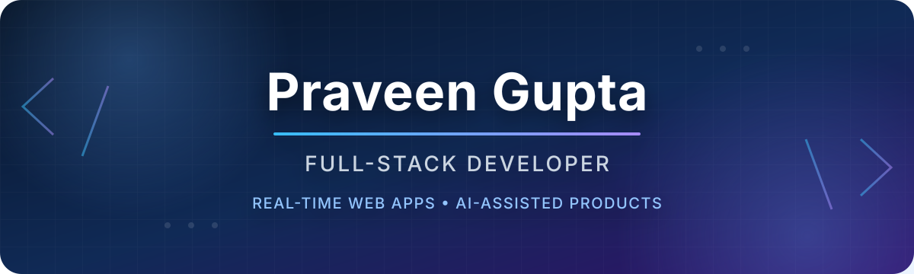
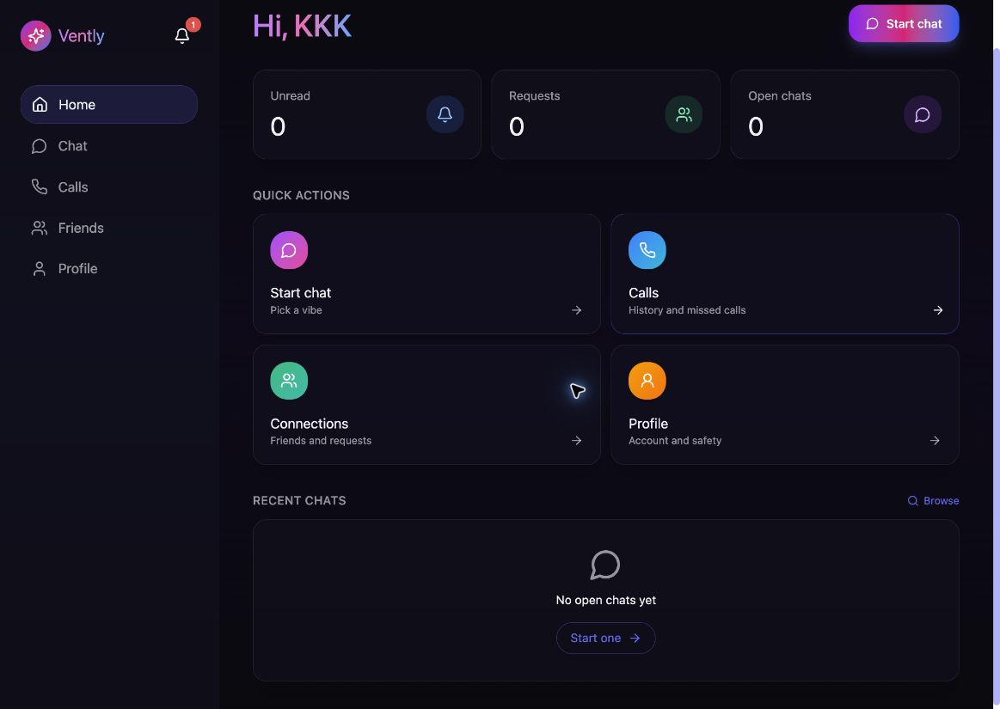
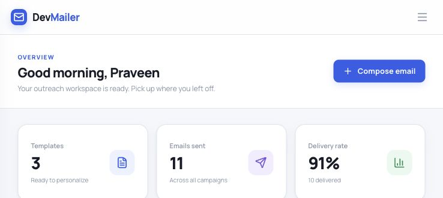
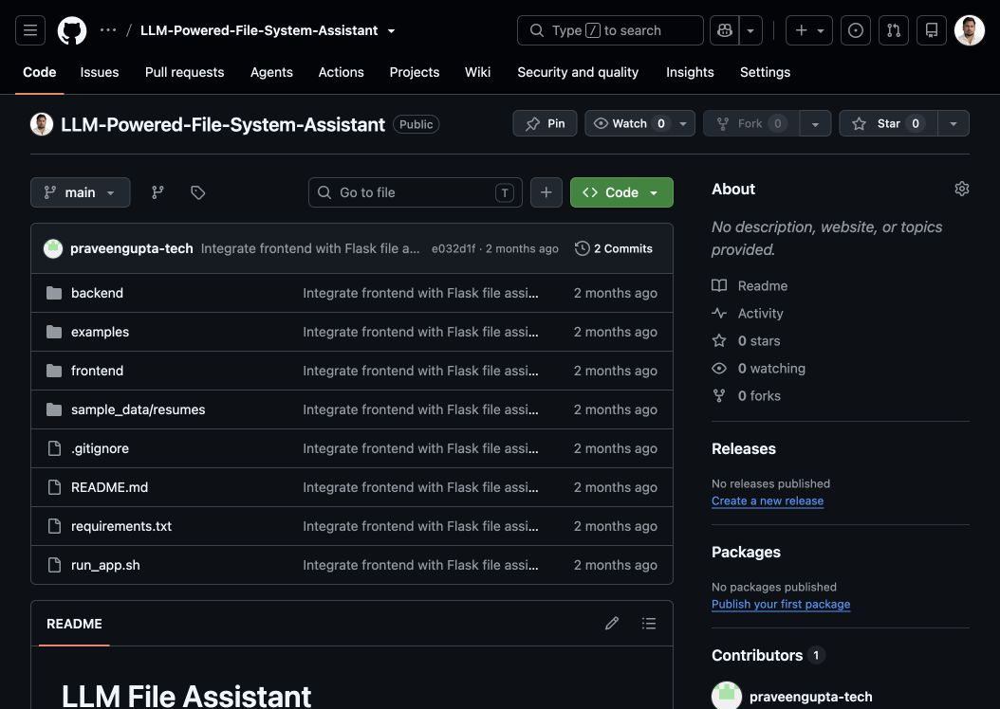
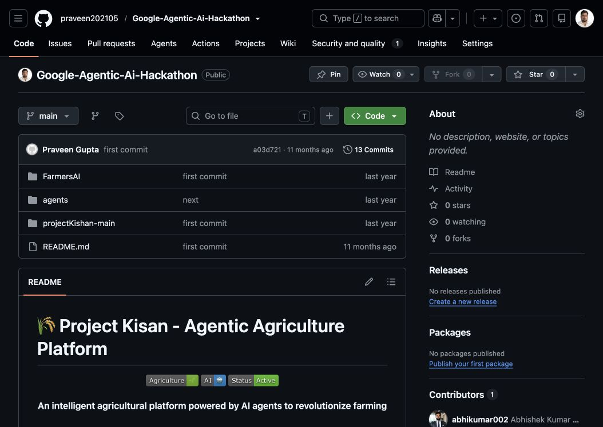
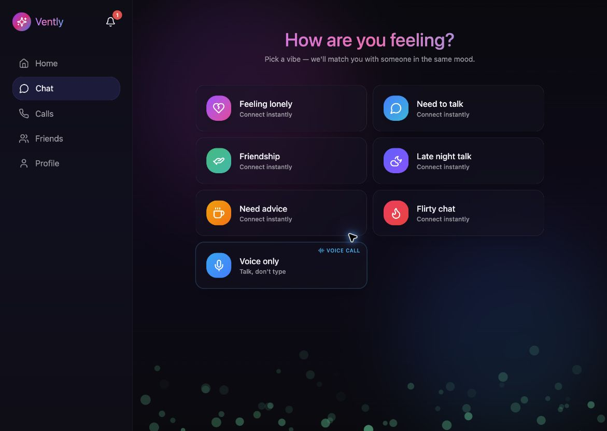
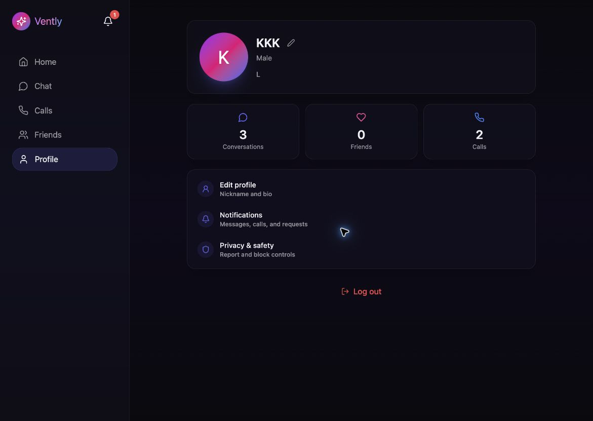
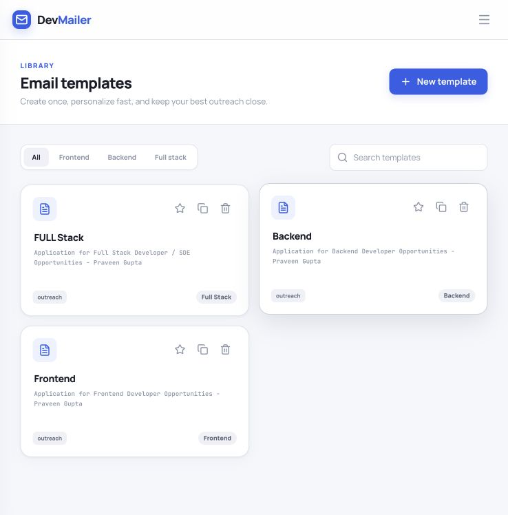

  

  

### Full-Stack Product Developer · Mumbai, India 🇮🇳

I am a full-stack developer at **FYND**, based in Mumbai, building reliable web products from interface to infrastructure. My work spans **TypeScript, React, Next.js, NestJS, Express, Python, PostgreSQL, MongoDB and Redis**.

I enjoy shipping end-to-end products—especially real-time applications and AI-assisted tools. Recent work includes anonymous chat and WebRTC voice calling, a focused email outreach workspace, and an LLM file-system assistant.

**What I bring →** Full-stack ownership + product thinking + the ability to turn an idea into a deployed application.

`🟢 Currently building real-time and AI-assisted product experiences`

  
  
  

## Selected work

<table>
  <tr>
    <td width="50%" valign="top">
      
      <h3 align="center">Vently</h3>
      
Anonymous emotional chat and WebRTC voice calling.

    </td>
    <td width="50%" valign="top">
      
      <h3 align="center">DevMailer</h3>
      
Email outreach with reusable templates and delivery tracking.

    </td>
  </tr>
  <tr>
    <td width="50%" valign="top">
      
      <h3 align="center">LLM File Assistant</h3>
      
LLM-powered tools for reading, searching and managing files.

    </td>
    <td width="50%" valign="top">
      
      <h3 align="center">Project Kisan</h3>
      
An agentic AI platform for modern agriculture.

    </td>
  </tr>
</table>

### Vently product tour

  
  
  

### DevMailer product tour

  
  

## Languages, tools and skills

## A little more about my work

- **Vently** ([live](https://vently-web-gamma.vercel.app/)) — anonymous emotional chat and WebRTC voice calling with Next.js, NestJS, Socket.IO, Prisma, PostgreSQL and Redis.
- **DevMailer** ([live](https://devmailer.up.railway.app/)) — email outreach workspace with reusable templates, personalized sending and delivery tracking.
- **LLM File Assistant** ([repository](https://github.com/praveen202105/LLM-Powered-File-System-Assistant)) — local file-system tooling powered by Flask, React/Vite and Groq-hosted language models, with direct read, list, write and search tools.
- **Project Kisan** ([live](https://nextjs-app-424265826546.asia-south1.run.app)) — agentic agriculture platform spanning Next.js, Android/Kotlin and a Python/FastAPI agents server.

## GitHub stats

  
  

  

### Let’s connect 🤝

I am always interested in thoughtful product ideas, full-stack engineering and practical AI applications.

  

